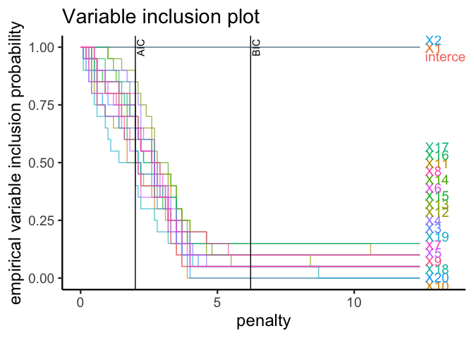

<!-- README.md is generated from README.Rmd. Please edit that file -->

# APES: APproximated Exhaustive Search for GLMs

[](https://github.com/kevinwang09/APES/actions)
[](https://codecov.io/github/kevinwang09/APES?branch=master)


APproximated Exhaustive Search (APES) is a model selection method for
Generalised Linear Models. The accompanying paper is [Wang et.
al. (2019)](https://doi.org/10.1111/anzs.12276). You can find the
vignette [here](https://kevinwang09.github.io/APES/articles/APES.html).

## Installation

``` r
library(devtools)
devtools::install_github("kevinwang09/APES")
```

## A quick example

Suppose we have simulated a data with 500 rows and 20 predictor
variables, and we have fitted a logistic regression model against a
binary response variable. We may wish to perform an exhaustive variable
selection on such a model to determine which variables produce the most
parsimonious model. However, performing an exhaustive variable selection
means looking through \(2^{20} = 1,048,576\) models\! Exhaustive
variable selection is known to be time consuming, and this might take a
long time.

APES is a variable selection method that first converts the logistic
model into a linear model and then it uses a best-subset algorithm (such
as leaps or mixed integer optimisation) to search for the best linear
model. The selected linear models are then converted into logistic
models. The reason for doing this is that the exhaustive variable
selection can be performed much faster in the linear model space.

The current implementation of APES supports logistic, poisson and Cox
regression models.

``` r
library(APES)

## Simulating data
set.seed(123)
n = 500
p = 20
k = 1:p
beta = c(1, -1, rep(0, p-2))
x = matrix(rnorm(n*p), ncol = p)
colnames(x) = paste0("X", 1:p)
y = rbinom(n = n, size = 1, prob = expit(x %*% beta))
data = data.frame(y, x)

## Fitting a full model 
model = glm(y ~ ., data = data, family = "binomial")

## Running APES selection
apes_result = apes(model = model)
apes_result
#> Time taken:  0.000188001  minutes 
#> 
#>  APES - AIC selected the following variables 
#> intercept        X1        X2        X3        X4        X5        X6        X7 
#>     0.064     1.226    -1.093     0.000     0.000     0.000     0.000     0.000 
#>        X8        X9       X10       X11       X12       X13       X14       X15 
#>     0.000     0.000     0.000     0.000     0.000     0.000     0.000     0.000 
#>       X16       X17       X18       X19       X20 
#>     0.000     0.000     0.000     0.000     0.000 
#> 
#>  APES - BIC selected the following variables 
#> intercept        X1        X2        X3        X4        X5        X6        X7 
#>     0.082     1.284    -1.137     0.000    -0.161     0.000     0.000     0.000 
#>        X8        X9       X10       X11       X12       X13       X14       X15 
#>     0.000     0.000     0.000     0.221     0.000     0.252    -0.162     0.000 
#>       X16       X17       X18       X19       X20 
#>     0.208     0.000     0.000     0.000     0.000
```

The best model of each model size are stored and the “best” model of all
can be selected using an information criterion such as the Akaike
Information Criterion (AIC) or the Bayesian Information Criterion (BIC).
Notice how in the above output of APES, the true model size is
identified as 3 and 2 by the AIC and BIC respectively. The selected
model estimates are also shown.

The bootstrap procedure can be used to understand the variable selection
stability. The APES package also comes with some plotting functions that
displays the bootstrapped results.

``` r
boot_result = apes(model = model, n_boot = 20)
boot_result
#> Time taken:  0.03013748  minutes 
#> Total number of bootstrap APES results:  20
plot(boot_result, type = "vip")
```

<!-- -->

# References

  - Wang, K. Y., Tarr, G., Yang, J. Y., & Mueller, S. (2019). Fast and
    approximate exhaustive variable selection for generalised linear
    models with APES. Australian & New Zealand Journal of Statistics,
    61(4), 445–465. <https://doi.org/10.1111/anzs.12276>
