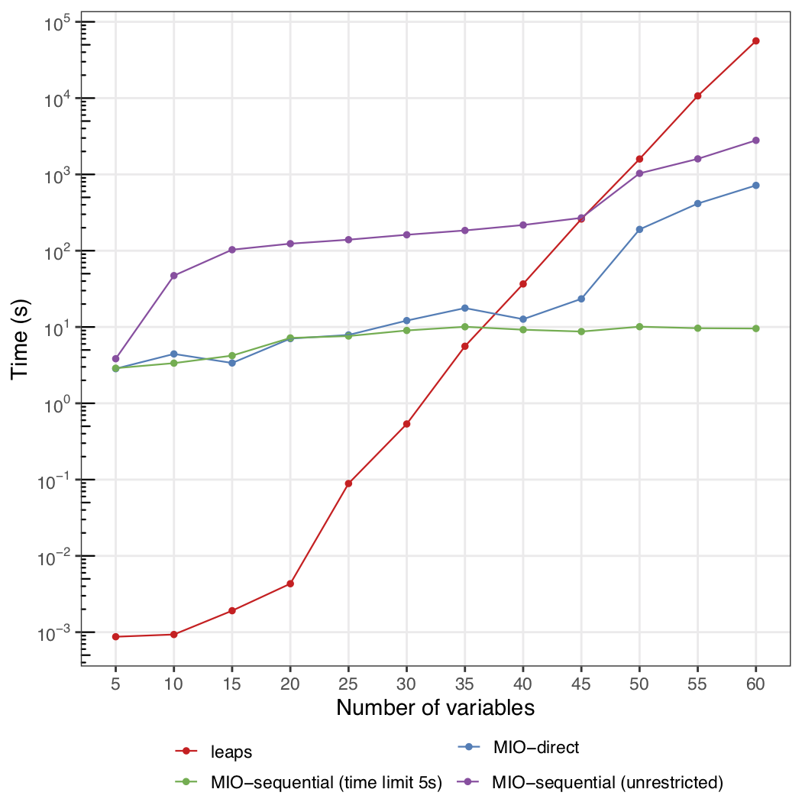

  
# Introduction

The APES method rely on a best subset algorithm for linear regression model. In the current implementation of the `APES` package, we allow for two options. One is the leaps-and-bound algorithm from the `leaps` package and Mixed Integer Optimisation from the `bestsubset` package with a backend connect to the Gurobi commercial software. 

You can learn about how to install Gurobi and the `bestsubset` package from [here](https://kevinwang09.github.io/APES/articles/install_bestsubset.html)

# Running APES with bestsubset

We will use a simulated example to demostrate APES with Gurobi Mixed Integer Optimisation (MIO) via the `bestsubset` package. Invoking this option can be done by specifying `estimator = "mio"`. 

```{r}
library(APES)
```

```{r, eval = FALSE, results='hide'}
## Simulating data
library(APES)
set.seed(10)
n = 100
p = 10
beta = c(1, -1, rep(0, p-2))
x = matrix(rnorm(n*p), ncol = p)
colnames(x) = paste0("X", 1:p)
y = rbinom(n = n, size = 1, prob = expit(x %*% beta))
data = data.frame(y, x)
model = glm(y ~ ., data = data, family = "binomial")

## Running APES
apes_result = apes(model = model, estimator = "mio")
apes_result
class(apes_result)
names(apes_result)
```

``` r
## Simulating data
library(APES)
set.seed(10)
n = 100
p = 10
beta = c(1, -1, rep(0, p-2))
x = matrix(rnorm(n*p), ncol = p)
colnames(x) = paste0("X", 1:p)
y = rbinom(n = n, size = 1, prob = expit(x %*% beta))
data = data.frame(y, x)
model = glm(y ~ ., data = data, family = "binomial")

## Running APES
apes_result = apes(model = model, estimator = "mio")
#> Registered S3 method overwritten by 'bestsubset':
#>   method     from   
#>   predict.bs splines
#> 0. Computing max eigenvalue of X^T X, for the step size in projected gradient descent.
#> 1. Solving best subset selection with k=1.
#> 1. Solving best subset selection with k=1.
#> 1. Solving best subset selection with k=1.
#>   a. Performing projected gradient runs: 1 ... 10 ... 20 ... 30 ... 40 ... 50 ... 
#>   b. Running Gurobi's mixed integer program solver ... Return status: OPTIMAL.
#> 2. Solving best subset selection with k=2.
#>   a. Performing projected gradient runs: 1 ... 10 ... 20 ... 30 ... 40 ... 50 ... 
#>   b. Running Gurobi's mixed integer program solver ... Return status: OPTIMAL.
#> 3. Solving best subset selection with k=3.
#>   a. Performing projected gradient runs: 1 ... 10 ... 20 ... 30 ... 40 ... 50 ... 
#>   b. Running Gurobi's mixed integer program solver ... Return status: OPTIMAL.
#> 4. Solving best subset selection with k=4.
#>   a. Performing projected gradient runs: 1 ... 10 ... 20 ... 30 ... 40 ... 50 ... 
#>   b. Running Gurobi's mixed integer program solver ... Return status: OPTIMAL.
#> 5. Solving best subset selection with k=5.
#>   a. Performing projected gradient runs: 1 ... 10 ... 20 ... 30 ... 40 ... 50 ... 
#>   b. Running Gurobi's mixed integer program solver ... Return status: OPTIMAL.
#> 6. Solving best subset selection with k=6.
#>   a. Performing projected gradient runs: 1 ... 10 ... 20 ... 30 ... 40 ... 50 ... 
#>   b. Running Gurobi's mixed integer program solver ... Return status: OPTIMAL.
#> 7. Solving best subset selection with k=7.
#>   a. Performing projected gradient runs: 1 ... 10 ... 20 ... 30 ... 40 ... 50 ... 
#>   b. Running Gurobi's mixed integer program solver ... Return status: OPTIMAL.
#> 8. Solving best subset selection with k=8.
#>   a. Performing projected gradient runs: 1 ... 10 ... 20 ... 30 ... 40 ... 50 ... 
#>   b. Running Gurobi's mixed integer program solver ... Return status: OPTIMAL.
#> 9. Solving best subset selection with k=9.
#>   a. Performing projected gradient runs: 1 ... 10 ... 20 ... 30 ... 40 ... 50 ... 
#>   b. Running Gurobi's mixed integer program solver ... Return status: OPTIMAL.
#> 10. Solving best subset selection with k=10.
#>   a. Performing projected gradient runs: 1 ... 10 ... 20 ... 30 ... 40 ... 50 ... 
#>   b. Running Gurobi's mixed integer program solver ... Return status: OPTIMAL.
apes_result
#> Time taken:  0.006937699  minutes 
#> 
#>  APES - AIC selected the following variables 
#> intercept        X1        X2        X3        X4        X5        X6        X7 
#>    -0.054     0.910    -1.123     0.000     0.000     0.000     0.000     0.000 
#>        X8        X9       X10 
#>     0.000     0.000     0.000 
#> 
#>  APES - BIC selected the following variables 
#> intercept        X1        X2        X3        X4        X5        X6        X7 
#>    -0.041     0.912    -1.145     0.000     0.000     0.000    -0.392     0.000 
#>        X8        X9       X10 
#>     0.000     0.000     0.000
class(apes_result)
#> [1] "apes"
names(apes_result)
#> [1] "apes_model_df"        "apes_mle_beta"        "apes_mle_beta_binary"
#> [4] "time_used"            "selected_model_beta"  "model_avg_beta"      
#> [7] "response_tibble"
```

# Comparing `leaps` and `bestsubset` (Gurobi MIO)

## Solving for `k` directly

Imagine that we have a data with $p = 10$ regressors and we are interested in getting the best model of size $k = 5$, where $k$ refers to the number of regressors with non-zero coefficient estimate. The `leaps` package is designed in such a way that all models of size $1, \dots, k$ are all computed and returned. This is a behaviour that is rooted in the leaps-and-bound algorithm and the intermediate computed models cannot be skipped. For large values of `p`, this could be very computationally heavy and unnecessary. On the other hand, the MIO algorithm is able to optimise for `k` directly. 

Continuing with the example above, if we specify an additional `k` parameter, then we can get the result for only one model using MIO but five models if we solve using `leaps`. Additionally, MIO is able to solve for model sizes in a range, e.g. by setting `k = 5:9`. The sequential behaviour of `leaps` means that it will be slower than MIO for large values of `p` but will be faster than MIO for small values of `p` due to the design of API. 

```{r, eval = FALSE, results='hide'}
## Simulating data
library(APES)
set.seed(10)
n = 100
p = 10
beta = c(1, -1, rep(0, p-2))
x = matrix(rnorm(n*p), ncol = p)
colnames(x) = paste0("X", 1:p)
y = rbinom(n = n, size = 1, prob = expit(x %*% beta))
data = data.frame(y, x)
model = glm(y ~ ., data = data, family = "binomial")

## leaps
leaps_result = apes(model = model, estimator = "leaps", k = 5)
leaps_result$apes_model_df

## mio
mio_result = apes(model = model, estimator = "mio", k = 5)
mio_result$apes_model_df

mio_result2 = apes(model = model, estimator = "mio", k = 5:9)
mio_result2$apes_model_df
```

``` r
## leaps
leaps_result = apes(model = model, estimator = "leaps", k = 5)
leaps_result$apes_model_df
#> # A tibble: 5 x 7
#>   model_name  model_size ic_opt_models apes_mle_loglike mle_aic mle_bic status  
#>   <chr>            <dbl> <chr>                    <dbl>   <dbl>   <dbl> <chr>   
#> 1 apes_model…          2 ""                       -59.4    123.    128. leaps_o…
#> 2 apes_model…          3 "apes_min_bi…            -53.3    113.    120. leaps_o…
#> 3 apes_model…          4 "apes_min_ai…            -51.8    112.    122. leaps_o…
#> 4 apes_model…          5 ""                       -51.2    112.    125. leaps_o…
#> 5 apes_model…          6 ""                       -50.6    113.    129. leaps_o…

## mio
mio_result = apes(model = model, estimator = "mio", k = 5)
#> Registered S3 method overwritten by 'bestsubset':
#>   method     from   
#>   predict.bs splines
#> 0. Computing max eigenvalue of X^T X, for the step size in projected gradient descent.
#> 1. Solving best subset selection with k=5.
#>   a. Performing projected gradient runs: 1 ... 10 ... 20 ... 30 ... 40 ... 50 ... 
#>   b. Running Gurobi's mixed integer program solver ... Return status: OPTIMAL.
mio_result$apes_model_df
#> # A tibble: 1 x 7
#>   model_name  model_size ic_opt_models   apes_mle_loglike mle_aic mle_bic status
#>   <chr>            <dbl> <chr>                      <dbl>   <dbl>   <dbl> <chr> 
#> 1 apes_model…          6 apes_min_aicap…            -50.6    113.    129. OPTIM…

mio_result2 = apes(model = model, estimator = "mio", k = 5:9)
#> 0. Computing max eigenvalue of X^T X, for the step size in projected gradient descent.
#> 1. Solving best subset selection with k=5.
#>   a. Performing projected gradient runs: 1 ... 10 ... 20 ... 30 ... 40 ... 50 ... 
#>   b. Running Gurobi's mixed integer program solver ... Return status: OPTIMAL.
#> 2. Solving best subset selection with k=6.
#>   a. Performing projected gradient runs: 1 ... 10 ... 20 ... 30 ... 40 ... 50 ... 
#>   b. Running Gurobi's mixed integer program solver ... Return status: OPTIMAL.
#> 3. Solving best subset selection with k=7.
#>   a. Performing projected gradient runs: 1 ... 10 ... 20 ... 30 ... 40 ... 50 ... 
#>   b. Running Gurobi's mixed integer program solver ... Return status: OPTIMAL.
#> 4. Solving best subset selection with k=8.
#>   a. Performing projected gradient runs: 1 ... 10 ... 20 ... 30 ... 40 ... 50 ... 
#>   b. Running Gurobi's mixed integer program solver ... Return status: OPTIMAL.
#> 5. Solving best subset selection with k=9.
#>   a. Performing projected gradient runs: 1 ... 10 ... 20 ... 30 ... 40 ... 50 ... 
#>   b. Running Gurobi's mixed integer program solver ... Return status: OPTIMAL.
mio_result2$apes_model_df
#> # A tibble: 5 x 7
#>   model_name  model_size ic_opt_models   apes_mle_loglike mle_aic mle_bic status
#>   <chr>            <dbl> <chr>                      <dbl>   <dbl>   <dbl> <chr> 
#> 1 apes_model…          6 "apes_min_aica…            -50.6    113.    129. OPTIM…
#> 2 apes_model…          7 ""                         -50.1    114.    132. OPTIM…
#> 3 apes_model…          8 ""                         -50.1    116.    137. OPTIM…
#> 4 apes_model…          9 ""                         -50.1    118.    142. OPTIM…
#> 5 apes_model…         10 ""                         -50.0    120.    146. OPTIM…
```

## Time limit

Another advantage of MIO over the leaps-and-bound algorithm is that MIO can stop the computation before a full convergence in the optimisation and yet still return the model that is considered to be optimal at that point in time. This is a very attractive property as we can specify a time limit when searching for a model instead of waiting for an unknown amount of time. 


```{r, eval = FALSE, results='hide'}
## Simulating data
library(APES)
set.seed(10)
n = 100
p = 10
beta = c(1, -1, rep(0, p-2))
x = matrix(rnorm(n*p), ncol = p)
colnames(x) = paste0("X", 1:p)
y = rbinom(n = n, size = 1, prob = expit(x %*% beta))
data = data.frame(y, x)
model = glm(y ~ ., data = data, family = "binomial")

mio_result3 = apes(model = model, estimator = "mio", k = 1:10, time_limit = 1)
mio_result3$apes_model_df
```

``` r
## Simulating data
mio_result3 = apes(model = model, estimator = "mio", k = 1:10, time_limit = 1)
#> Registered S3 method overwritten by 'bestsubset':
#>   method     from   
#>   predict.bs splines
#> 0. Computing max eigenvalue of X^T X, for the step size in projected gradient descent.
#> 1. Solving best subset selection with k=1.
#>   a. Performing projected gradient runs: 1 ... 10 ... 20 ... 30 ... 40 ... 50 ... 
#>   b. Running Gurobi's mixed integer program solver ... Return status: OPTIMAL.
#> 2. Solving best subset selection with k=2.
#>   a. Performing projected gradient runs: 1 ... 10 ... 20 ... 30 ... 40 ... 50 ... 
#>   b. Running Gurobi's mixed integer program solver ... Return status: OPTIMAL.
#> 3. Solving best subset selection with k=3.
#>   a. Performing projected gradient runs: 1 ... 10 ... 20 ... 30 ... 40 ... 50 ... 
#>   b. Running Gurobi's mixed integer program solver ... Return status: OPTIMAL.
#> 4. Solving best subset selection with k=4.
#>   a. Performing projected gradient runs: 1 ... 10 ... 20 ... 30 ... 40 ... 50 ... 
#>   b. Running Gurobi's mixed integer program solver ... Return status: OPTIMAL.
#> 5. Solving best subset selection with k=5.
#>   a. Performing projected gradient runs: 1 ... 10 ... 20 ... 30 ... 40 ... 50 ... 
#>   b. Running Gurobi's mixed integer program solver ... Return status: OPTIMAL.
#> 6. Solving best subset selection with k=6.
#>   a. Performing projected gradient runs: 1 ... 10 ... 20 ... 30 ... 40 ... 50 ... 
#>   b. Running Gurobi's mixed integer program solver ... Return status: OPTIMAL.
#> 7. Solving best subset selection with k=7.
#>   a. Performing projected gradient runs: 1 ... 10 ... 20 ... 30 ... 40 ... 50 ... 
#>   b. Running Gurobi's mixed integer program solver ... Return status: OPTIMAL.
#> 8. Solving best subset selection with k=8.
#>   a. Performing projected gradient runs: 1 ... 10 ... 20 ... 30 ... 40 ... 50 ... 
#>   b. Running Gurobi's mixed integer program solver ... Return status: OPTIMAL.
#> 9. Solving best subset selection with k=9.
#>   a. Performing projected gradient runs: 1 ... 10 ... 20 ... 30 ... 40 ... 50 ... 
#>   b. Running Gurobi's mixed integer program solver ... Return status: OPTIMAL.
#> 10. Solving best subset selection with k=10.
#>   a. Performing projected gradient runs: 1 ... 10 ... 20 ... 30 ... 40 ... 50 ... 
#>   b. Running Gurobi's mixed integer program solver ... Return status: OPTIMAL.
mio_result3$apes_model_df
#> # A tibble: 10 x 7
#>    model_name   model_size ic_opt_models apes_mle_loglike mle_aic mle_bic status
#>    <chr>             <dbl> <chr>                    <dbl>   <dbl>   <dbl> <chr> 
#>  1 apes_model_2          2 ""                       -59.4    123.    128. OPTIM…
#>  2 apes_model_3          3 "apes_min_bi…            -53.3    113.    120. OPTIM…
#>  3 apes_model_4          4 "apes_min_ai…            -51.8    112.    122. OPTIM…
#>  4 apes_model_5          5 ""                       -51.2    112.    125. OPTIM…
#>  5 apes_model_6          6 ""                       -50.6    113.    129. OPTIM…
#>  6 apes_model_7          7 ""                       -50.1    114.    132. OPTIM…
#>  7 apes_model_8          8 ""                       -50.1    116.    137. OPTIM…
#>  8 apes_model_9          9 ""                       -50.1    118.    142. OPTIM…
#>  9 apes_model_…         10 ""                       -50.0    120.    146. OPTIM…
#> 10 apes_model_…         11 ""                       -49.9    122.    151. OPTIM…
```

## Computational speed

We will conclude this vignette with a figure that shows the different computation options and the time cost associated with each option. We hope this can help the end-users to select the best combination of input parameters for their data problems. 

In the plot below, we fix `k = 15` and `n = 500`, where `n` is the number of observations. We grdually increase number of regressors (`p`) in simulated data and plot it on the x-axis. There are four options that we explored:

1. APES-leaps, which uses `leaps` to sequentially search for the optimal model of size `k`. 

2. APES-MIO-sequential, which uses MIO to sequentially search for the optimal models
up to size `k`. We do not impose a time limit in this case. 

3. APES-MIO-sequential-threshold, which uses MIO to sequentially search for the
optimal models up to size `k`. We impose a time limit of 5 seconds in this case.

4. APES-MIO-direct, which uses MIO to directly search for the optimal model of size `k`.

{width=100%}

It can be seen that the leaps implementation can be orders of magnitudes faster than the MIO implementations when $p < 35$. When p increases from 40 to 50, leaps overtook all MIO implementations with a much steeper increase in time taken. This simple demonstration shows that leaps is preferred in cases where p is small or moderate and MIO is virtually the only viable option for $p > 50$.

# Session Info
```{r}
sessionInfo()
```
